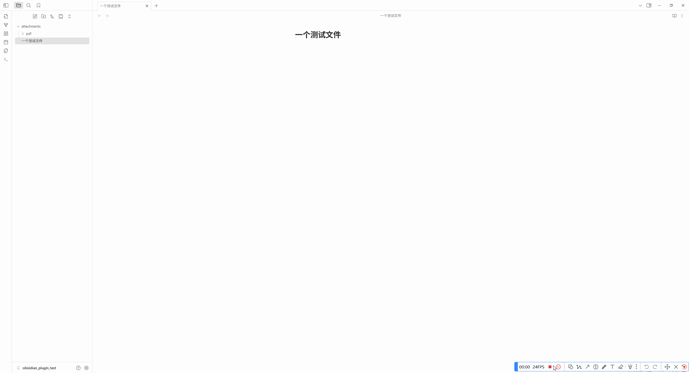

# File Router

Automatically route files into folders based on regular expressions.
Effortlessly organize your PDFs, images, and notes in Obsidian.

---

## 🛠️ Demo

As shown in the example below, once configured, newly added files like images or PDFs are automatically moved to the specified folder.
If timestamp-based renaming is enabled, the file name will automatically be updated with a timestamp to avoid duplicates.



---

## ✨ Features

* 📁 **Automatically move files based on regex rules**
  Route files into folders according to filename patterns.

* 🚫 **Skip specific files**
  Exclude certain files from processing based on rules.

* ⌛ **Timestamp-based file renaming**
  Automatically rename new files using a timestamp to avoid name collisions.

* 🔄 **Real-time file handling**
  Files are organized instantly when created or added.

* ⚙️ **Simple and flexible configuration**
  Easy to configure using a regex table.

---

## 🚧 Planned Features

* Add regex validation to prevent misconfigurations.
* Supports relative path to decide Target Folder.

---

## 🔧 Example Rules

| Regex                                 | Target Folder       |
| ------------------------------------- | ------------------- |
| `\.(png\|jpg\|jpeg\|bmp\|gif\|webp)$` | `attachments/image` |
| `\.(pdf)$`                            | `attachments/pdf`   |

> ✔️ Example: When inserting an image like `screenshot.png`, it will automatically move to `/attachments/image/`.

---

## 📦 How It Works

1. ⚙️ You define a set of rules using regular expressions.
2. 📄 When a new file is created (via paste, drag-drop, or attachment), File Router checks the rules.
3. 🔍 If the filename matches a regex, it is moved to the corresponding folder. 
4. 🔄 Files that don't match any rule will remain in their default location.

---

## 📁 Example Configuration

```json
[
  { "regex": "\\.(pdf)$", "targetDir": "attachments/pdf" },
  { "regex": "\\.(png|jpg|jpeg|bmp|gif|webp)$", "targetDir": "attachments/image" },
]
```

## 🗂️ Example Folder Structure

```
vault/
├── attachments/
│   ├── image/
│   └── pdf/
├── note1.md
└── note2.md
```

---

## ❤️ Contribution & Feedback

* 💡 Feature requests and pull requests are welcome!
* 🐛 Found a bug? Please open an issue.
* 🌟 If you like this plugin, give it a ⭐️ on GitHub!

---

## 🙏 Acknowledgements

This project is inspired by and references code from [obsidian-attachment-management](https://github.com/trganda/obsidian-attachment-management).
Special thanks to the author for providing an excellent foundation for handling file attachments in Obsidian.

---

## 🏗️ License

MIT License.